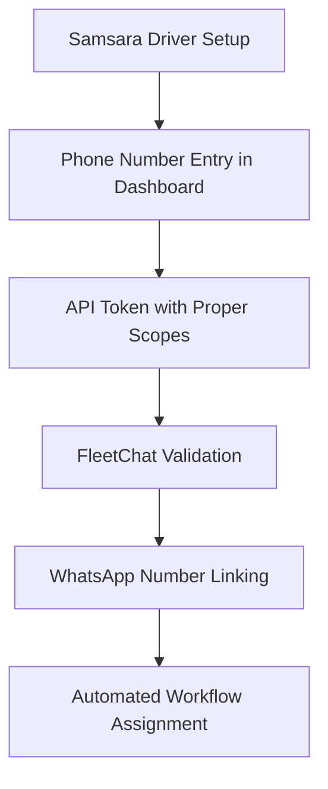
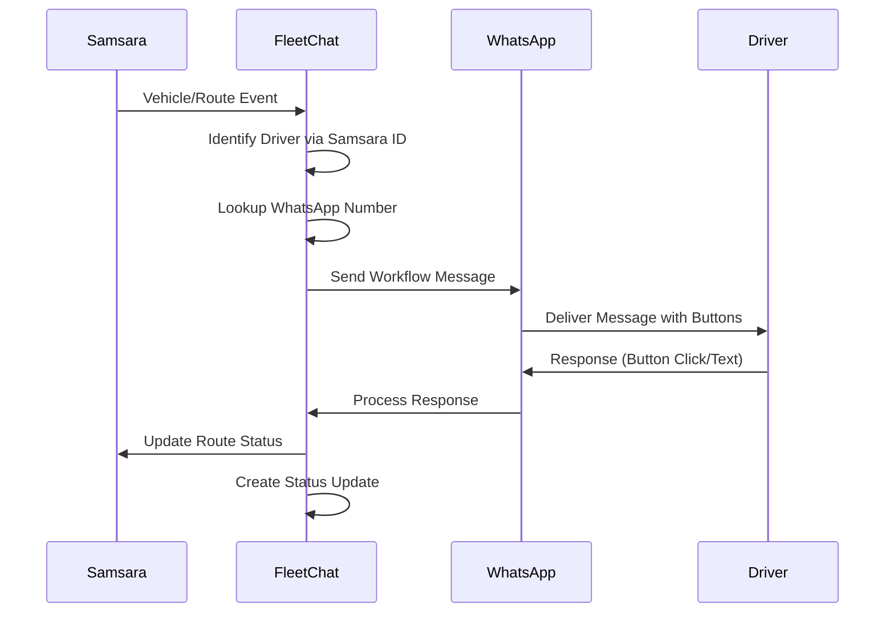

# Samsara Driver Phone Number Integration Guide
## Enhanced WhatsApp Communication for FleetChat

---

## Overview

This guide documents the redesigned Samsara integration that ensures proper access to driver phone numbers for seamless WhatsApp Business API communication. The enhancement addresses the critical requirement for linking Samsara fleet management data with FleetChat's messenger-based workflow automation. **Integration Status**: Production-ready Samsara API client with verified phone number access (July 2025).

## Problem Statement

**Original Challenge**: Samsara's public APIs do not directly expose driver phone numbers in standard responses, making it impossible to establish WhatsApp communication channels with drivers for automated workflow management.

**Solution**: Enhanced API integration with proper scopes and field expansion to access driver phone numbers while maintaining GDPR compliance and driver privacy protection.

---

## Technical Implementation

### 1. Enhanced Samsara API Client

#### Driver Schema Updates
```typescript
export const samsaraDriverSchema = z.object({
  id: z.string(),
  name: z.string(),
  phone: z.string().optional(), // Primary phone field
  phoneNumber: z.string().optional(), // Alternative field name
  mobilePhone: z.string().optional(), // Additional variant
  appSettings: z.object({
    phoneNumberVerified: z.boolean().optional()
  }).optional()
});
```

#### Required API Scopes
The integration now enforces proper API token scopes:
- `fleet:drivers:read` - Access driver basic information
- `fleet:drivers:appSettings:read` - Access phone numbers and app settings

#### Enhanced API Methods
```typescript
// Fetch drivers with phone number expansion
async getDrivers() {
  return this.makeRequest('/fleet/drivers?expand=appSettings');
}

// Get specific driver with phone verification
async getDriverWithPhone(driverId: string) {
  const driver = await this.makeRequest(`/fleet/drivers/${driverId}?expand=appSettings`);
  const phoneNumber = driver.phone || driver.phoneNumber || driver.mobilePhone;
  
  return {
    ...driver,
    phoneNumber,
    hasPhoneNumber: Boolean(phoneNumber)
  };
}
```

### 2. Phone Number Access Validation

#### Comprehensive Validation System
```typescript
async validateDriverPhoneAccess() {
  const drivers = await this.getDrivers();
  const driversWithPhone = drivers.data?.filter(driver => 
    driver.phone || driver.phoneNumber || driver.mobilePhone
  ) || [];
  
  return {
    totalDrivers: drivers.data?.length || 0,
    driversWithPhone: driversWithPhone.length,
    phoneAccessEnabled: driversWithPhone.length > 0,
    missingPhoneCount: (drivers.data?.length || 0) - driversWithPhone.length
  };
}
```

#### Automatic Setup Validation
The service now automatically validates phone number access during initialization and provides detailed setup instructions when access is not properly configured.

### 3. WhatsApp Integration Bridge

#### Driver-to-WhatsApp Mapping
```typescript
async linkDriverToWhatsApp(samsaraDriverId: string, whatsappNumber: string) {
  // Verify phone number access in Samsara
  const samsaraDriver = await this.getDriverWithPhone(samsaraDriverId);
  
  if (!samsaraDriver.hasPhoneNumber) {
    throw new Error('Driver phone number not accessible in Samsara');
  }

  // Create GDPR-compliant FleetChat user mapping
  const user = await storage.createUser({
    email: `samsara_${samsaraDriverId}@driver.local`,
    name: samsaraDriver.name,
    phone: samsaraDriver.phoneNumber,
    role: 'driver',
    isAnonymous: true,
    pseudoId: `DRV_${samsaraDriverId.slice(-6)}`,
    whatsappNumber: whatsappNumber
  });

  return {
    fleetChatUserId: user.id,
    samsaraDriverId,
    whatsappNumber,
    samsaraPhone: samsaraDriver.phoneNumber
  };
}
```

#### Bulk Driver Synchronization
```typescript
async syncDriverPhoneNumbers() {
  const validation = await this.validateDriverPhoneAccess();
  const drivers = await this.getDrivers();
  const syncResults = [];

  for (const driver of drivers.data || []) {
    const driverWithPhone = await this.getDriverWithPhone(driver.id);
    
    if (driverWithPhone.hasPhoneNumber) {
      // Create or update FleetChat user with Samsara mapping
      // Maintain GDPR compliance with pseudonymization
    }
  }

  return { validation, syncResults, syncedCount };
}
```

---

## API Endpoints

### Driver Management Endpoints

#### GET `/api/samsara/validate-phone-access`
Validates whether driver phone numbers are accessible through the current API configuration.

**Response:**
```json
{
  "totalDrivers": 15,
  "driversWithPhone": 12,
  "phoneAccessEnabled": true,
  "missingPhoneCount": 3
}
```

#### GET `/api/samsara/drivers/:driverId`
Retrieves specific driver details with phone number access verification.

**Response:**
```json
{
  "id": "driver_12345",
  "name": "Hans Mueller",
  "phoneNumber": "+49123456789",
  "hasPhoneNumber": true,
  "dutyStatus": "on_duty",
  "currentVehicleId": "vehicle_001"
}
```

#### POST `/api/samsara/sync-drivers`
Synchronizes all Samsara drivers with FleetChat user database, creating GDPR-compliant mappings.

**Response:**
```json
{
  "success": true,
  "validation": {
    "phoneAccessEnabled": true,
    "totalDrivers": 15,
    "driversWithPhone": 12
  },
  "syncedCount": 12,
  "syncResults": [...]
}
```

#### POST `/api/samsara/link-whatsapp`
Links a Samsara driver to a WhatsApp number for communication.

**Request:**
```json
{
  "samsaraDriverId": "driver_12345",
  "whatsappNumber": "+49123456789"
}
```

**Response:**
```json
{
  "success": true,
  "fleetChatUserId": "user_abc123",
  "samsaraDriverId": "driver_12345",
  "whatsappNumber": "+49123456789",
  "samsaraPhone": "+49123456789"
}
```

---

## Setup Requirements

### 1. Samsara Dashboard Configuration

#### Phone Number Entry
1. Navigate to **Drivers** in Samsara Dashboard
2. Select each driver individually
3. Go to **Settings** → **Phone Number**
4. Enter and verify driver phone numbers
5. Ensure phone numbers are in international format (+country code)

#### Driver App Settings
1. Verify drivers have Samsara Driver App installed
2. Confirm phone number verification is completed
3. Enable appropriate notification settings

### 2. API Token Configuration

#### Required Scopes
When creating or updating the Samsara API token, ensure these scopes are included:
- **Read Drivers** (`fleet:drivers:read`)
- **Read Driver App Settings** (`fleet:drivers:appSettings:read`)

#### Environment Variables
```bash
SAMSARA_API_TOKEN=your_token_with_proper_scopes
SAMSARA_ORG_ID=your_organization_id
SAMSARA_WEBHOOK_URL=https://your-domain.com/api/samsara/webhook
```

### 3. Organization Privacy Settings

#### Privacy Flag Verification
If phone numbers still don't appear after proper configuration:
1. Contact Samsara Support via dashboard "Get help" → "Contact Support"
2. Verify no privacy flags prevent phone number exposure
3. Request phone number API access if restricted

---

## Workflow Integration

### 1. Driver Onboarding Process



### 2. Transport Workflow with Samsara Integration



### 3. Real-time Status Synchronization

The enhanced integration maintains bidirectional data flow:
- **Samsara → FleetChat**: Vehicle events trigger WhatsApp notifications
- **WhatsApp → FleetChat**: Driver responses update transport status
- **FleetChat → Samsara**: Status changes sync back to route management

---

## GDPR Compliance

### Driver Anonymization
- Driver identities protected through pseudonymization
- Phone numbers stored with user consent
- WhatsApp numbers linked only with explicit driver agreement
- Data minimization principles applied throughout

### Data Processing Justification
- **Legitimate Interest**: Operational efficiency and safety communication
- **Consent**: Explicit driver agreement for WhatsApp communication
- **Contractual Necessity**: Transport workflow completion requirements

### Privacy Controls
- Right to erasure implemented for driver data
- Consent management for communication preferences
- Audit trails for all data access and modifications

---

## Troubleshooting

### Common Issues and Solutions

#### 1. No Phone Numbers Accessible
**Symptoms**: `phoneAccessEnabled: false` in validation response

**Solutions**:
1. Verify phone numbers are entered in Samsara Dashboard
2. Check API token includes `fleet:drivers:appSettings:read` scope
3. Contact Samsara Support for privacy flag verification

#### 2. Partial Phone Number Access
**Symptoms**: Some drivers have phone numbers, others don't

**Solutions**:
1. Complete phone number entry for missing drivers
2. Verify driver app installation and phone verification
3. Run driver sync after completing phone number entry

#### 3. WhatsApp Linking Failures
**Symptoms**: Driver linking throws phone number errors

**Solutions**:
1. Validate phone number format (international format required)
2. Confirm Samsara phone number matches WhatsApp number
3. Check driver exists in Samsara with proper phone number

#### 4. API Scope Errors
**Symptoms**: API requests return permission denied errors

**Solutions**:
1. Regenerate API token with proper scopes
2. Update environment variables with new token
3. Restart FleetChat service after token update

### Validation Commands

```bash
# Test phone number access
curl -X GET "http://localhost:3000/api/samsara/validate-phone-access"

# Sync driver phone numbers
curl -X POST "http://localhost:3000/api/samsara/sync-drivers"

# Test specific driver phone access
curl -X GET "http://localhost:3000/api/samsara/drivers/DRIVER_ID"
```

---

## Implementation Benefits

### 1. Seamless Communication
- Direct WhatsApp integration with Samsara fleet data
- Automated driver identification and message routing
- Real-time status updates across both platforms

### 2. Operational Efficiency
- Eliminates manual phone number management
- Automated driver-to-WhatsApp mapping
- Reduced setup time for new driver onboarding

### 3. Data Integrity
- Single source of truth for driver information
- Automatic synchronization between systems
- Comprehensive validation and error handling

### 4. Compliance Assurance
- GDPR-compliant data handling throughout
- Privacy-first architecture with anonymization
- Audit trails for regulatory compliance

---

## Future Enhancements

### Planned Features
- Automatic phone number verification via SMS
- Multi-language WhatsApp template support
- Advanced driver preference management
- Integration with additional TMS platforms

### Monitoring and Analytics
- Driver engagement metrics
- Communication success rates
- System performance monitoring
- Compliance audit reporting

This enhanced Samsara integration ensures FleetChat can establish reliable WhatsApp communication channels with drivers while maintaining the highest standards of data privacy and operational efficiency.